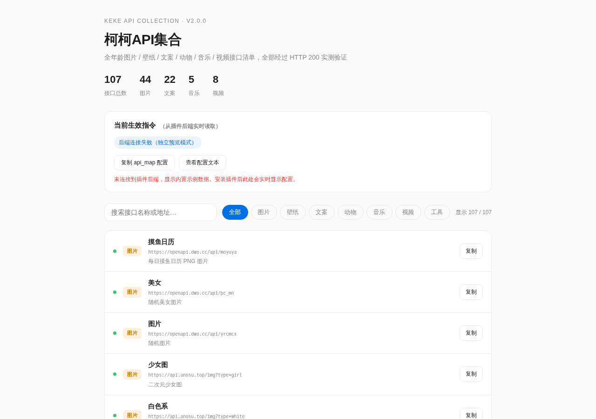

<div align="center">

# 柯柯API集合 · Keke API Collection

**AstrBot 多功能 API 聚合插件 —— 图片 · 壁纸 · 文案 · 动物 · 音乐 · 视频，一个插件全部搞定**

[](https://github.com/KeKe0904/astrbot_plugin_keke_api_collection)
[](https://github.com/AstrBotDevs/AstrBot)
[](500源总清单.md)
[](LICENSE)

</div>

---

## 📖 简介

柯柯API集合是一个为 [AstrBot](https://github.com/AstrBotDevs/AstrBot) 开发的 API 聚合插件。它将分散在互联网各处的**免费公开接口**（图片、壁纸、文案、语录、动物、音乐、视频等全年龄内容）统一封装为聊天指令，并支持：

- 🎛️ **管理面板自由配置** —— 接口挂了？改配置就行，不用碰代码
- 🧩 **自定义指令** —— 面板里加一行 `指令名|接口地址`，新指令即刻生效
- 🖥️ **插件 WebUI 页面** —— 内置管理面板，实时查看生效配置、浏览全部接口
- 📦 **500+ 接口清单** —— 附赠 513 条实测/候选接口文档

## ✨ 功能特性

| 特性 | 说明 |
|------|------|
| ✅ 新版 AstrBot 适配 | 移除废弃 `@register`，支持 AstrBot 4.x（>= 3.5.19 自动识别 Star 类） |
| ✅ 532 条指令开箱即用 | 33 个内置指令 + 499 个全量接口，全部预置直接可用 |
| ✅ 面板配置化 | `_conf_schema.json` 声明，WebUI 可视化编辑 `api_map` |
| ✅ 自定义指令 | 配置新增的指令名自动注册，无需写代码 |
| ✅ WebUI 指令管理 | 展示全部指令，可增删改、一键保存、逐条测试 + 批量测速 |
| ✅ 请求增强 | UA 伪装、指数退避重试、429/5xx 处理、Retry-After 尊重 |
| ✅ 响应智能识别 | 图片 / 音频 / 视频 / JSON / 文本自动解析 |
| ✅ 接口大换血 | 全部接口 2026-08-08 实测，替换全部失效源 |

## 🖥️ 插件页面预览

> 在 AstrBot WebUI → 插件 → 柯柯API集合 → 「接口管理」即可打开



## 🚀 快速开始

### 安装

1. 将插件放入 AstrBot 插件目录（目录名必须为 `astrbot_plugin_keke_api_collection`）：

```bash
git clone https://github.com/KeKe0904/astrbot_plugin_keke_api_collection
# 或手动将解压后的文件夹放入插件目录
```

2. 在 AstrBot WebUI 或命令行重载插件。

### 使用

**500+ 接口全部开箱即用**：安装插件后，除 33 个内置指令外，499 个全量接口（图片/壁纸/文案/动物/音乐/视频/工具）已全部预置在 `api_map` 配置中，**直接发送接口指令名即可调用**，无需任何配置。

在聊天中直接发送指令即可，例如：

```
摸鱼日历        → 返回今日摸鱼日历图片
壁纸            → 返回随机 PC 壁纸
一言            → 返回一句一言
猫图            → 返回随机猫图
网易云歌单      → 返回网易云热门歌单
B站热门         → 返回 B站 当前热门视频
```

发送 `帮助` 查看全部可用指令。

## 🎮 指令大全（内置 33 个）

### 图片

| 指令 | 数据源 | 说明 |
|------|--------|------|
| 摸鱼日历 | openapi.dwo.cc | 每日摸鱼日历图片 |
| 美女 | openapi.dwo.cc | 随机美女图片 |
| 图片 | openapi.dwo.cc | 随机图片 |
| 少女图 | api.anosu.top | 二次元少女图 |
| 白色系 | api.anosu.top | 白色系二次元图 |
| 黑色系 | api.anosu.top | 黑色系二次元图 |
| 萌系 | api.anosu.top | 萌系动漫图 |
| COS图 | api.anosu.top | COS 图片 |

### 壁纸

| 指令 | 数据源 | 说明 |
|------|--------|------|
| 壁纸 | t.mwm.moe | PC 壁纸 |
| 风景 | t.mwm.moe | 风景壁纸 |
| 手机壁纸 | t.mwm.moe | 手机壁纸 |
| 原神壁纸 | t.mwm.moe | 原神主题壁纸 |
| 高清壁纸 | t.mwm.moe | 高清壁纸 |
| 4K壁纸 | t.mwm.moe | 4K 壁纸 |
| 二次元 | dmoe.cc | 二次元随机图 |
| 东方 | img.paulzzh.com | 东方Project 图 |
| ACG壁纸 | loliapi.com | ACG 随机图 |
| 动漫壁纸 | api.btstu.cn | 动漫壁纸 |
| 必应壁纸 | bing.com | Bing 每日壁纸 |

### 文案

| 指令 | 数据源 | 说明 |
|------|--------|------|
| 文案 | openapi.dwo.cc | 随机文案 |
| 舔狗日记 | openapi.dwo.cc | 舔狗日记 |
| 一言 | v1.hitokoto.cn | 一言 |
| 今日诗词 | v1.jinrishici.com | 今日诗词 |
| 每日一句 | api.xygeng.cn | 每日一句 |
| 笑话 | v2.jokeapi.dev | 多语言笑话 |

### 动物

| 指令 | 数据源 | 说明 |
|------|--------|------|
| 猫图 | cataas.com | 随机猫图 |
| 狗狗 | dog.ceo | 随机狗图 |
| 柴犬 | shibe.online | 柴犬图 |
| 狐狸 | randomfox.ca | 狐狸图 |

### 音乐 / 视频 / 其他

| 指令 | 数据源 | 说明 |
|------|--------|------|
| 网易云歌单 | api.i-meto.com | 网易云热门歌单 |
| 音乐直链 | api.injahow.cn | MP3 直链 |
| B站热门 | api.bilibili.com | B站热门视频（含 bvid） |
| 头像 | api.dicebear.com | 随机机器人头像 |
| 设备信息 | 本地 | 服务器基本信息（脱敏） |
| 帮助 / 菜单 | 本地 | 查看全部指令 |

## 🧩 自定义指令

无需写代码，在管理面板的 `api_map` 配置中添加一行即可注册新指令：

```
每日壁纸|https://t.mwm.moe/pc
我的语录|https://api.xygeng.cn/one
```

> 保存配置并**重载插件**后，新指令自动生效；删除某行即禁用对应指令。

### 指令别名

内置别名：`摸鱼`→摸鱼日历、`随机图/随机图片`→图片、`猫猫`→猫图、`狗图`→狗狗 等。

## ⚙️ 配置说明（_conf_schema.json）

| 配置项 | 类型 | 默认值 | 说明 |
|--------|------|--------|------|
| `api_map` | list | 532 条（33 内置 + 499 全量） | 指令映射表，格式 `指令名|接口地址`，全部预置，可增删改 |
| `timeout` | int | 10 | 请求超时（秒） |
| `max_retries` | int | 3 | 失败最大重试次数 |
| `user_agent` | str | Chrome UA | 请求 UA（B站等接口需要） |

修改后需在 AstrBot WebUI 中重载插件生效。

## 🖥️ WebUI 管理面板

插件内置「接口管理」页面（`pages/panel/index.html`），基于 AstrBot 官方 [插件 Pages](https://docs.astrbot.app/dev/star/guides/plugin-pages.html) 机制实现：

- 📡 **实时配置**：通过插件后端 API 读取当前生效的指令与接口
- 📋 **一键复制**：复制单个接口地址，或复制完整 `api_map` 配置文本
- 🔍 **浏览检索**：107 个精选接口按 7 大分类浏览、搜索、筛选
- 🌓 **主题适配**：自动跟随 AstrBot 亮 / 暗主题

## 📦 接口清单（500+）

随插件附带两份实测文档：

| 文档 | 内容 |
|------|------|
| [500源总清单.md](500源总清单.md) | **513 条**：188 条实测可用 + 325 条公开文档候选（2026-08-08 十轮实测） |
| [图源清单_2026-08-08.md](图源清单_2026-08-08.md) | **103 条**实测可用图源 / 文案源 / 工具源，含失效黑名单 |

> 所有接口均为全年龄内容。实测时间：2026-08-08。

## ❓ 常见问题

**Q：某个指令没反应 / 返回失败？**
免费公开接口可能随时失效。在管理面板的 `api_map` 中把该指令地址替换为 [500源总清单.md](500源总清单.md) 中的备选源，重载插件即可。

**Q：B站热门为什么返回的是文字链接？**
B站官方接口返回 JSON 视频列表（含 `bvid`），插件解析后返回视频标题与播放页链接。纯视频直链接口在 2026 年已基本绝迹。

**Q：如何添加一个全新的接口？**
1. 确认接口返回图片 / 音频 / JSON 图链 / 文本中的一种；
2. 在 `api_map` 添加 `指令名|接口地址`；
3. 重载插件，新指令即可使用。

**Q：WebUI 页面显示「后端连接失败」？**
独立浏览器打开 HTML 文件时无法连接插件后端，属正常现象。通过 AstrBot WebUI 的插件详情页打开即可实时读取配置。

**Q：插件对 AstrBot 版本有要求吗？**
要求 AstrBot >= 3.5.19（自动识别 Star 类）。已在 4.26.8 实测通过。

## 🛠️ 技术实现

- Python 异步 + `aiohttp`
- ClientSession 生命周期管理 + `asyncio.Lock` 防竞态
- 指数退避重试 + 429/5xx 处理 + Retry-After 尊重
- 响应自动识别：`image/*` → 图片、`audio/*` → 音乐链接、JSON → 图链/文本提取
- B站视频 JSON、Meting 歌单 JSON 专用解析
- 脱敏日志，不泄露外部响应内容
- 插件 Pages 官方机制 + `context.register_web_api()` 后端 API

## 📝 更新日志

### v2.0.0（2026-08-08）
- **重构**：移除废弃 `@register`，适配新版 AstrBot；配置化 `api_map`
- **新增**：28 个新接口（壁纸全家桶、白色系/黑色系、动物、音乐、B站视频等）；插件 WebUI 页面；自定义指令
- **增强**：UA 伪装、指数退避、429 处理、audio/video 识别、B站/Meting 解析、指令别名
- **移除**：已失效的 api.pldduck.com 接口（原白丝/黑丝）

完整历史见 [CHANGELOG.md](CHANGELOG.md)。

## 🤝 支持

- [AstrBot 项目](https://github.com/AstrBotDevs/AstrBot)
- [AstrBot 插件开发文档（中文）](https://docs.astrbot.app/dev/star/plugin-new.html)
- [AstrBot 插件 Pages 指南](https://docs.astrbot.app/dev/star/guides/plugin-pages.html)

## 📄 许可证

[MIT License](LICENSE)

---

<div align="center"><sub>Made with ❤️ by 落梦陳 · 柯柯API集合 v2.0.0</sub></div>
